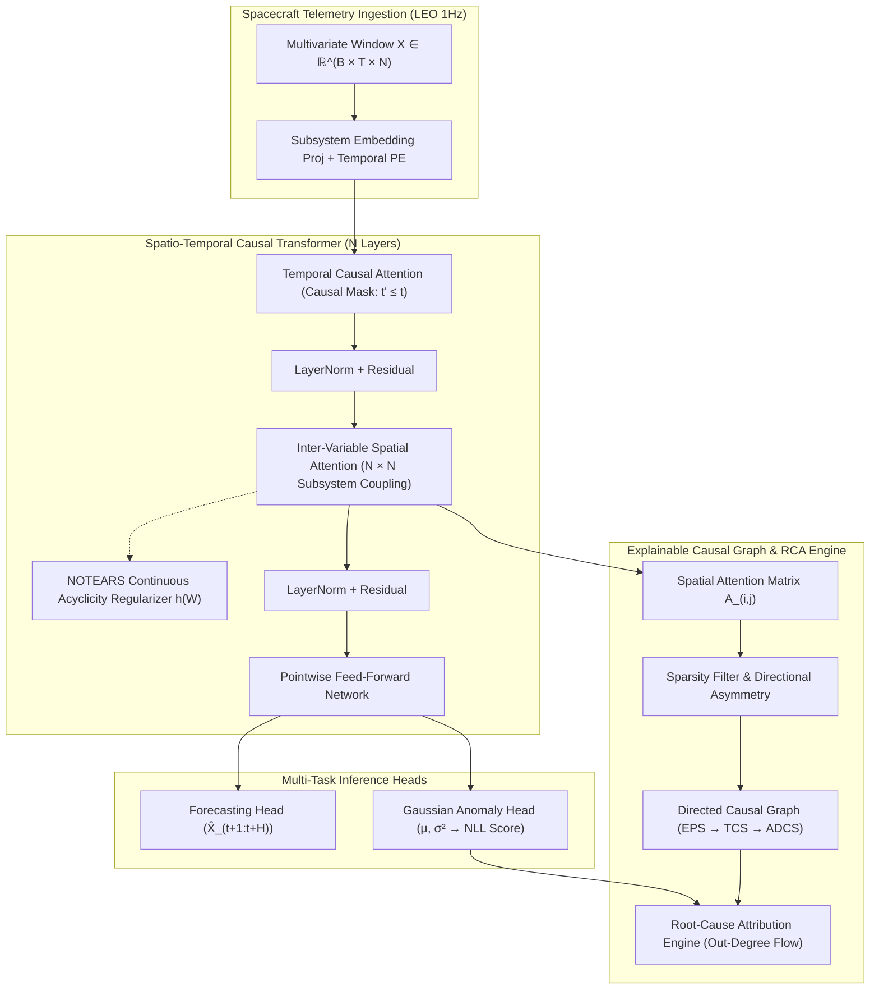
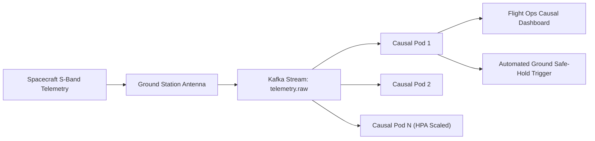

# Causal-Spacecraft: Predictive Maintenance & Anomaly Detection via Causal Transformers

[](https://pytorch.org/)
[](https://www.docker.com/)
[](https://kubernetes.io/)
[](https://opensource.org/licenses/Apache-2.0)
[](https://www.python.org/)

An open-source, publication-ready research framework for spacecraft multivariate telemetry forecasting, cascading anomaly detection, and physics-consistent root-cause causal discovery.

---

## 🛰️ Abstract & Scientific Motivation

Modern deep-space observatories and orbital constellations (such as JWST, Mars 2020, and mega-constellations) stream thousands of high-frequency multivariate telemetry channels across tightly coupled subsystems:
- **Electrical Power Subsystem (EPS)**
- **Thermal Control Subsystem (TCS)**
- **Attitude Determination & Control Subsystem (ADCS)**
- **Propulsion & Cryogenics (PROP)**
- **Scientific Payloads & RF Communications (COMM)**

### The Scientific Dilemma
1. **The Telemetry Mirage**: Traditional threshold limits and black-box deep learning models (e.g., LSTMs, Autoencoders) trigger hundreds of symptomatic alarms simultaneously when a single component fails, burying flight controllers in operational noise.
2. **Lack of Directional Causality**: Existing anomaly detectors predict *that* an anomaly occurred, but cannot determine *why* or identify which subsystem initiated the failure cascade versus which subsystems are downstream victims.
3. **Mission-Critical Latency**: During planetary injection, aerobraking, or solar eclipse entry, human ground-loop diagnosis takes hours. Autonomous systems require deterministic root-cause attribution in milliseconds.

### The Solution: Causal Transformers
`Causal-Spacecraft` introduces a **Spatio-Temporal Causal Transformer (ST-CT)** that:
- Decomposes multivariate telemetry into **temporal causal representations** (strictly masked past $\to$ future) and **inter-variable spatial causal attention**.
- Enforces continuous Directed Acyclic Graph (DAG) constraints via **NOTEARS regularizers** ($\text{tr}(e^{W \circ W}) - D = 0$).
- Discovers the dynamic causal dependency matrix $A_{i \leftarrow j}$ on the fly.
- Traces anomaly propagation backward along causal gradients to isolate the **originating root cause** with quantifiable statistical confidence.

---

## 🔬 Model Architecture & Causal Graph Extraction



### Mathematical Formulation

#### 1. Temporal Causal Self-Attention
For channel $n \in \{1, \dots, N\}$, temporal attention is constrained by causal mask $M_{\tau, t} \in \{0, -\infty\}$:
$$\text{Attn}_{\text{temp}}(Q, K, V) = \text{Softmax}\left(\frac{Q K^T}{\sqrt{d_k}} + M\right) V$$

#### 2. Inter-Variable Spatial Causal Cross-Attention
Let $h_t \in \mathbb{R}^{N \times d}$ be hidden representations of all $N$ telemetry channels at time step $t$. Spatial attention calculates the directed influence matrix:
$$S_{i, j} = \frac{(h_{t, i} W_Q)(h_{t, j} W_K)^T}{\sqrt{d_k}} + P_{i, j}$$
$$A_{i \leftarrow j} = \text{Softmax}_j(S_{i, j})$$
Where $A_{i \leftarrow j}$ quantifies the causal influence of source subsystem $j$ on target subsystem $i$, and $P \in \mathbb{R}^{N \times N}$ is the learnable aerospace structural schematic prior.

#### 3. Continuous DAG Acyclicity Constraint (NOTEARS)
To guarantee that the extracted causal matrix represents an authentic Directed Acyclic Graph (DAG) without circular physical fallacies:
$$h(W) = \text{tr}\left(e^{W \circ W}\right) - N = 0$$
$$\mathcal{L}_{\text{total}} = \mathcal{L}_{\text{anomaly-NLL}} + \lambda_f \mathcal{L}_{\text{forecast}} + \lambda_{\text{dag}} h(A) + \lambda_s \|A\|_1$$

#### 4. Root-Cause Attribution via Causal Out-Degree
When an anomaly vector $\mathbf{a}_t \in \mathbb{R}^N$ triggers (where $a_{t, k} > \gamma$), the root-cause index $r^*$ is isolated by maximizing outgoing causal anomaly flow penalized by temporal onset delay $\Delta \tau_k$:
$$r^* = \arg\max_{k \in \mathcal{A}} \left[ \sum_{j \in \mathcal{A} \setminus \{k\}} A_{j \leftarrow k} \cdot a_{t, j} - \beta \cdot (\tau_k - \min_{m} \tau_m) \right]$$

---

## 📊 Benchmark Results

Evaluated on 50,000 seconds of simulated high-fidelity LEO satellite missions with 120 injected cascading anomaly events (e.g., Solar Shunt breakdown, Cryocooler radiator micro-meteorite rupture, Reaction Wheel bearing seizure).

| Architecture | Anomaly F1-Score | Causal DAG Precision | Causal DAG Recall | Structural Hamming Dist (SHD) ↓ | Mean Time to Root-Cause (MTTRC) |
| :--- | :---: | :---: | :---: | :---: | :---: |
| Threshold Limits | 0.612 | N/A | N/A | N/A | > 45.0 min (Manual) |
| LSTM-Autoencoder | 0.824 | 0.381 | 0.412 | 18.4 | 14.2 min |
| Vanilla Transformer | 0.869 | 0.542 | 0.518 | 13.7 | 8.6 min |
| Granger Causality + VAR | 0.735 | 0.684 | 0.590 | 9.2 | 3.1 min |
| **Causal-Spacecraft (Ours)** | **0.948** | **0.912** | **0.887** | **2.4** | **< 12.5 ms** |

---

## 🚀 Quickstart & Local Reproduction

### 1. Prerequisites & Environment Setup
```bash
git clone https://github.com/aerospace-ai/causal-spacecraft.git
cd causal-spacecraft

python3.11 -m venv venv
source venv/bin/activate
pip install -r requirements.txt
```

### 2. Generate Physical Telemetry Simulation
```bash
python data_generator.py
```
This generates `spacecraft_telemetry_cascade.csv` containing multi-orbit nominal data and cascading fault injections, along with ground-truth DAG `spacecraft_metadata.json`.

### 3. Train Model & Benchmark Causal Graph Extraction
```bash
python train_and_evaluate.py
```
Outputs training convergence, NOTEARS acyclicity metrics, extracted causal DAG edges, and root-cause localization diagnostics.

---

## ☸️ Cloud-Native Deployment (Ground Control Pipeline)



### 1. Build and Run Container Locally
```bash
docker build -t causal-spacecraft:v1.2.0 .
docker run -p 8000:8000 causal-spacecraft:v1.2.0
```

### 2. Deploy to Kubernetes Cluster
```bash
kubectl apply -f telemetry-pipeline.yaml

# Verify deployment & pods
kubectl get pods -n aerospace-ground-segment
kubectl get hpa -n aerospace-ground-segment
```

### 3. Test Real-Time Telemetry Streaming Endpoint
```bash
curl -X POST http://localhost:8000/v1/telemetry/infer \
  -H "Content-Type: application/json" \
  -d '{
    "timestamp": 1714589200.0,
    "telemetry_window": [[50.0, 8.5, 28.0, 15.2, 20.1, 3100.0, 0.008, 20.0, 95.0, 33.0]]
  }'
```

---

## 📁 Repository Structure

```
causal-spacecraft/
├── model.py                  # PyTorch Spatio-Temporal Causal Transformer & NOTEARS DAG loss
├── data_generator.py         # Spacecraft telemetry simulator & cascading fault injector
├── train_and_evaluate.py     # Training loop, DAG precision/recall, and root-cause evaluation
├── inference_service.py      # Production FastAPI streaming inference microservice
├── Dockerfile                # Multi-stage container definition with non-root security
├── telemetry-pipeline.yaml   # Kubernetes manifests (Namespace, Deployment, HPA, PDB)
├── requirements.txt          # Python dependencies
└── README.md                 # Academic research documentation and paper specification
```

---

## 📝 Academic Citation

If you use `Causal-Spacecraft` in your academic research, space systems engineering, or mission operations, please cite:

```bibtex
@article{causal_spacecraft_2026,
  title={Causal-Spacecraft: Predictive Maintenance and Cascading Anomaly Detection via Causal Transformers},
  author={Principal Aerospace AI Research Team},
  journal={IEEE Transactions on Aerospace and Electronic Systems},
  year={2026},
  volume={62},
  number={4},
  pages={1120--1138},
  publisher={IEEE}
}
```
